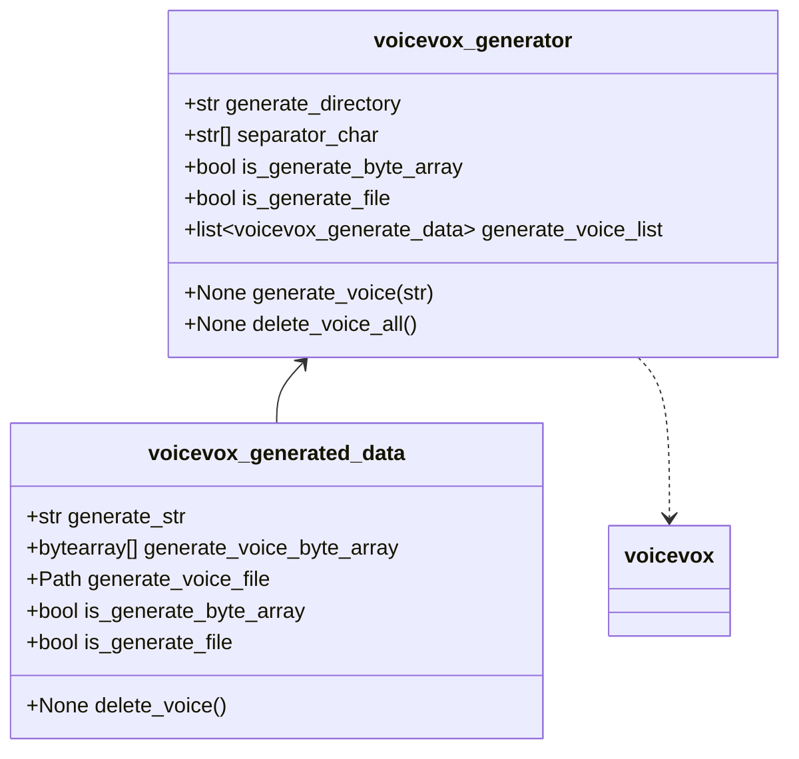

# 構想

文字列から、VOICEVOXの音声を生成するPythonのヘルパーライブラリを作成する。

# コア機能

以下コア機能の実装を目指す。

- 長い文字列を分割して並行に生成できること
- メモリ上のバッファ、または実ファイルとして保持すること
- 話者関連の指定が可能なこと
- 生成ファイルの削除が容易なこと
    - 読み上げなどで使用する場合は都度削除の想定

# クラス概要

## クラス図

## 使い方想定

1. `voicevox_generator`クラスのインスタンスを生成する。
1. `generate_voice(str)`を呼び出す。文章の区切りごとに、音声データを生成して`generate_voice_list`に追加する。
1. `generate_voice_list`を参照し、音声ファイルを利用する。
1. 不要になれば、`delete_voice_all()`を呼び出し、`generate_voice_list`の内容をクリアする。

**`generate_voice_list`の内容を別途保存する必要がある場合は呼び出し側で処理する。**

# 処理概要

## 長い文字列の分割生成

「。」「.」で区切り、区切りごとに並列で音声を生成する。
全ての生成が完了した後、`generate_voice`は結果をリターンする。

→常に「。」「.」で区切ってもいいのかどうかは作ってから考える。
